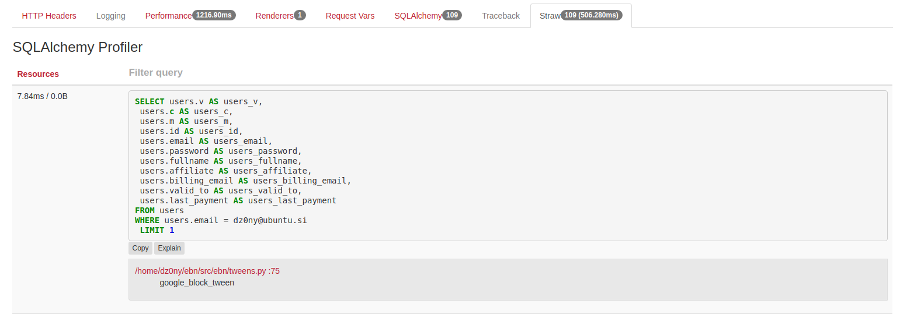
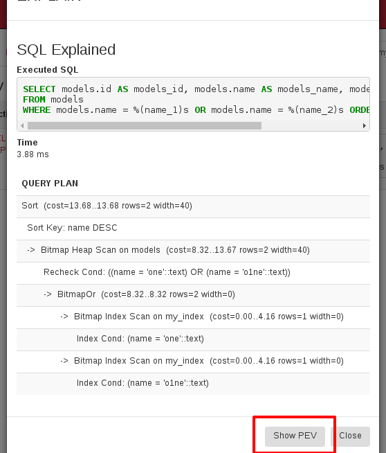
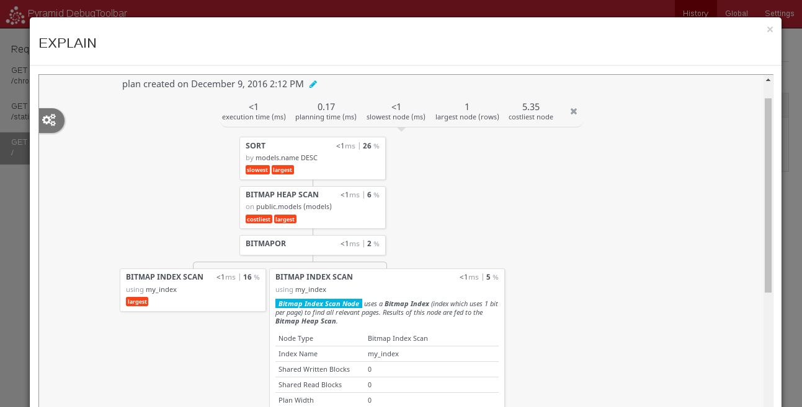

# Pyramid Straw

[](https://travis-ci.org/dz0ny/pyramid_straw)

The first tool you should use to analyze whats going on with
your database, when developing pyramid apps.


---




## Installing

Include project after debug_toolbar.

```
pyramid.includes =
    pyramid_straw.profiler
    pyramid_straw.panel
```

# Configuration

Project consists of two parts

## Config options

```
pyramid_straw.only_paths
pyramid_straw.report_hook
pyramid_straw.disable_inspect
```

### pyramid_straw.only_paths
If you want to limit what is backtraced for  each query
(defaults to package where it is included). You can override
``pyramid_straw.only_paths``.

For example:
```
pyramid_straw.only_paths = ['/home/dz0ny/ebn/src/']
```

### pyramid_straw.report_hook
And if you want to send reports somewhere else you can use
 report hook that needs to be callable and accepts data dict for
 each query. This would be little expensive in production so beware.

For example:
```
def report_hook(data):
    requests.post(config.my_report_url, json=data)

config.add_settings({
    'pyramid_straw.report_hook': report_hook
})
```


### pyramid_straw.disable_inspect

You can also disable query inspection with setting ```disable_inspect```
to false. For example:

```
config.add_settings({
    'pyramid_straw.disable_inspect': False
}) ```
